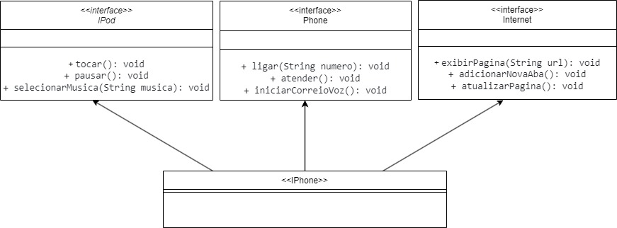
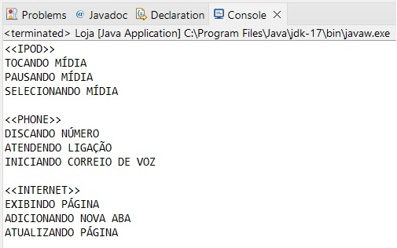

# Desafio de Projeto sobre Diagrama de Classes UML da DIO/GFT
Este projeto se refere a diagramação de classes do Iphone com UML.

## Diagrama UML
O diagrama a seguir foi criado com o software draw.io.

## Executando a Classe Loja.java
Resultado da execução da Classe Loja.java

